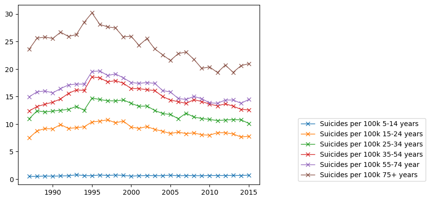

# Analysis of Global Suicides

## Goal
Do an analysis of Global Suicides and how they vary with respect to Age, Sex ans Country

## Dataset
Dataset given by Keggle : [Link Here](https://www.kaggle.com/datasets/russellyates88/suicide-rates-overview-1985-to-2016) .

## Description
I used seaborn and matplotlib libraries to do EDA on Suicide Rates

## Work Done
* Importing seaborn, mathplotlib for the solution
* Visualising the suicide per 100k of Male vs Female. It was noted that Men have ~3.5 times the probability of suicide compared to Women.
* Visualising the suicide per 100k of different age groups. It was a trend that as age increases the suicides also increases.
* Visualising the suicide per 100k if different countries. It was seen Lithuvania had the highest suicide rate at 41 per 100k.
* By fitting the model we could observe that the number of suicides did not depend on the gdp per capita of the country.

## Libraries used
* seaborn
* Mathplotlib
* os

## Analysis with respect to Sex : 

## Analysis with respect to Age : 

## Analysis with respect to Country : 

## Analysis with respect to countries based on just college students

## The fit line showing the relation between per capita gdp and the suicides per 100k

